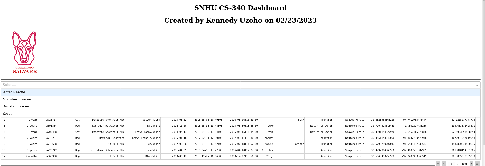
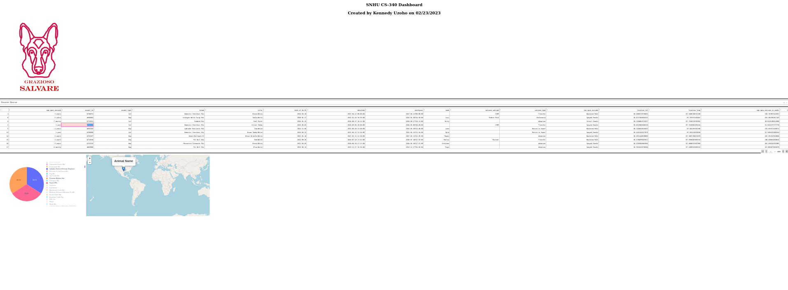

# CS 340 Portfolio
- Code
    - [Dashboard](../CS-340-Portfolio/ProjectTwoDashboard.ipynb)
    - [CRUD Module](../CS-340-Portfolio/module/animal_shelter.py)
- [About](#about)
- [Getting Started](#getting-started)
- [CRUD Module and CLI guide](#crud-module-and-cli-guide)
- [Dashboard Functionality](#dashboard-functionality)
- [Development Reflection](#development-reflection)
- [Tools Used](#tools-used)

## About 

### Technical Target
The aim of this project is to create a web-based dashboard with data visualization and allows for interactive exploration of the dataset used. The dashboard is built using the Dash framework in Python, and the data is stored in a MongoDB database. 

### Animal Shelter Project Motivation
The main motivation of this project is to create an interactive interface for project user to interact with the animal collection in the AAC database. The user will read and create documents in the database. Creating, Reading, Updating, and deleting objects/files are essential for interacting with databases. Following the project motivation, it is aslo important to automate accessibility and queries within the Mongo Database using Python Mongo driver (Pymongo). 

### Getting Started
If you wish to run the code on a local machine follow these steps: <br>
Prerequisites:
- Get a copy/install MongoDB
- Perform local system configuration and make sure mongodb is running...
1. Start the MongoDB service
    
    ```zsh
    mongod
    ```
2. Import the “aac_shelter_outcomes.csv” dataset using the following command
    ```zsh
    mongoimport --port <PORT#> --db AAC --collection animals --type=csv --headerline  <PATH_TO_CSV>aac_shelter_outcomes.csv
    ```
3. Launch Mongo shell and create the 'admin' and 'aacuser' accounts

    ```zsh
    mongosh
    db.createUser({user:’admin’,pwd:passwordPrompt(),roles:[{role:’userAdminAnyDatabase’,db:’admin’},’readWriteAnyDatabase’]})
    db.createUser({user:’aacuser’,pwd:passwordPrompt(),roles:[{role:’readWrite’,db:’AAC’ }]})
    ```
4. Restart MongoDB service with auth
    ```zsh
    mongod --shutdown
    mongod
    ```
5.  Now you can install the Animal Shelter package and create a new instance to connect to the database.
    ```python
    client = AnimalShelter (<USER>, <PASSWORD>, <PORT>, <AUTH_SRC>)
    ```

## CRUD Module and CLI guide
[Load Data, Use CRUD, and Test against the database and CRUD Module.](docs/Project_One_Readme.pdf)

## Dashboard Functionality

### All available filters!
You can chose what to filter via the dropdown  menu provided


### Dashboard with geolocation and pie chart
Once you chose what dog data to filter, the charts will adjust accordingly!


## Development Reflection (CompSci)

###### How do you write programs that are maintainable, readable, and adaptable? Especially consider your work on the CRUD Python module from Project One, which you used to connect the dashboard widgets to the database in Project Two. What were the advantages of working in this way? How else could you use this CRUD Python module in the future?

Maintaining a program can be facilitated by making it modular and reusable, which allows for easy addition of functionality and ensures it remains up-to-date. In addition to modularity, writing comments that clearly explain the code’s functionality significantly improves readability. Adaptability is another crucial aspect, as modular code can be easily adjusted to handle different incoming or outgoing data types, making it flexible and capable of meeting diverse requirements. By following these practices, a programmer can build programs that are maintainable, readable, and adaptable.

###### How do you approach a problem as a computer scientist? Consider how you approached the database or dashboard requirements that Grazioso Salvare requested. How did your approach to this project differ from previous assignments in other courses? What techniques or strategies would you use in the future to create databases to meet other client requests?

As a computer scientist, my problem-solving approach begins by identifying the desired outcome and selecting the appropriate tools to achieve it. I prioritize building foundational components before advancing to higher-level functions. This project posed a unique challenge as it was my first experience working with databases. To address this, I built the database, created the CRUD module, and used it to develop the interactive dashboard. This project provided an opportunity to expand my skillset and introduced me to valuable techniques, such as the CRUD module. I now understand the importance of data aggregation when working with large datasets and limited search time.

###### What do computer scientists do, and why does it matter? How would your work on this type of project help a company, like Grazioso Salvare, to do their work better?

Computer scientists play a crucial role in problem-solving by developing software that processes data at speeds far beyond human capability, performs calculations with greater accuracy and precision, and creates technology that simplifies lives and enhances business operations. The significance of computer scientists and their work is evident, as computers have revolutionized the world. Without them, we wouldn’t have advanced 3D graphics in films, video games, or even the ability to quickly tally the number of employees across various companies in different states. Projects like this are vital to companies, enabling them to locate and retrieve information quickly and with minimal effort. For instance, this project helped Grazioso Salvare find the desired dog records based on specific age ranges and breeds, saving hours of manual research among 10,000 records. Moreover, the project is designed to be expandable, accommodating any future records, making it a one-time effort for Grazioso Salvare.

## Tools Used

#### MongoDB

[mongodb.com](https://www.mongodb.com)

MongoDB is a NoSQL data that was used in this project. Instead of having to define columns and rows, each record is stored as document containing all of its own properties and values. This helps in creating and interacting with data in a dashboards. 

#### Python

[python.org](https://www.python.org)

Python was used as the main programming language for this project

#### PyMongo

[pymongo.readthedocs.io](https://pymongo.readthedocs.io/en/stable/)

PyMongo is the recommended driver for using Python to interact with MongoDB.

#### Dash Framework

[plotly.com/dash](https://plotly.com/dash/)

Dash is a Python framework that works excels at creating web-based dashboards to display data.
